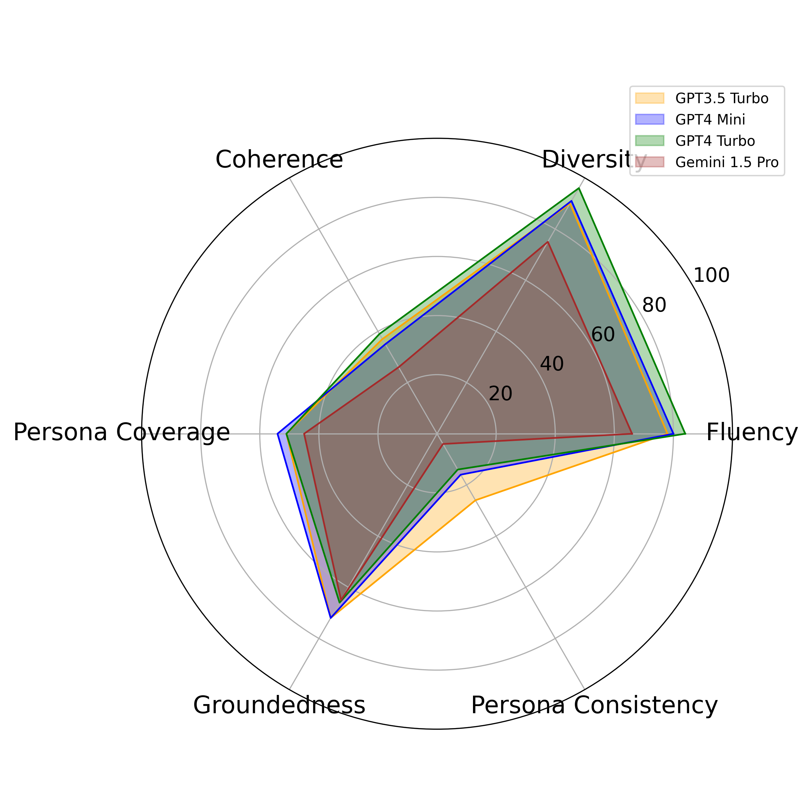
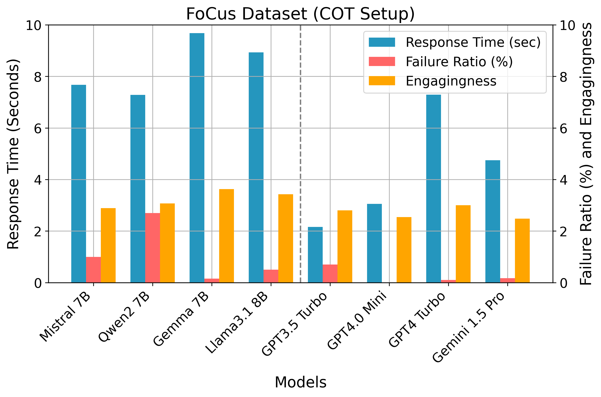

# PersoBench
### Benchmarking Personalized Response Generation in Large Language Models


## Abstract
While large language models (LLMs) have exhibited impressive conversational capabilities, their proficiency in delivering personalized responses remains unclear. Although recent benchmarks automatically evaluate persona consistency in role-playing contexts using LLM-based judgment, the evaluation of personalization in response generation remains underexplored. To address this gap, we present a new automated benchmarking framework, **PersoBench**, to evaluate the personalization ability of LLMs in persona-aware dialogue generation within a zero-shot setting. Our framework employs a structured pipeline comprising speaker-aware annotation, task-specific and context-driven prompt construction, response post-processing, and automated evaluation across multiple dimensions of generation quality. We assess the performance of three open-source and three closed-source LLMs using well-known datasets and a range of explicit metrics. Our analysis, conducted on three well-known persona-aware datasets, evaluates multiple dimensions of response quality, including fluency, diversity, coherence, and personalization, across both standard and chain-of-thought prompting methods. Our findings reveal that while LLMs excel at generating fluent and diverse responses, they are far from satisfactory in delivering personalized and coherent responses, considering both the conversation context and the provided personas.


## Figures

|  | 
|:----------------------------------------------------------:|
| Fig.1 - Overview of the PersoBench automatic personalization benchmark framework.|

<div align="center" style="margin: 30px 0;">

<table>
  <tr>
    <td align="center">
      <br/>
      (a)
    </td>
    <td align="center">
      <br/>
      (b)
    </td>
    <td align="center">
      <br/>
      (c)
    </td>
    <td align="center">
      <br/>
      (d)
    </td>
  </tr>
</table>

<br/>

<em>
Performance analysis of (a) open-source LLMs in vanilla setting,  
(b) closed-source LLMs in vanilla setting,  
(c) open-source LLMs in COT setting,  
(d) closed-source LLMs in COT setting on the FoCus dataset.
</em>

</div>


<div align="center" style="margin: 30px 0;">

<table>
  <tr>
    <td align="center">
      <br/>
      (a) Vanilla setup
    </td>
    <td align="center">
      <br/>
      (b) COT setup
    </td>
  </tr>
</table>

<br/>

<em>
Analysis of response time, failure ratio, and engagingness of LLMs on the FoCus dataset:  
(a) Vanilla and (b) COT setups.
</em>

</div>


<div align="center">

### 📊 Model Rankings on FoCus Dataset  
*(Scores are averages of: **Coherence, Persona Coverage, Groundedness, Persona Consistency, Instructability** — Fluency and Diversity excluded)*

<table>
<tr>
<td valign="top">

#### Vanilla Ranking
| Rank | Model         | Vanilla Score |
|------|---------------|---------------|
| 1    | GPT-3.5 Turbo | 37.36         |
| 2    | GPT-4.0 Mini  | 35.57         |
| 3    | GPT-4 Turbo   | 34.19         |
| 4    | Gemini 1.5 Pro| 28.19         |
| 5    | Gemma 7B      | 20.63         |
| 6    | Mistral 7B    | 14.63         |
| 7    | Llama-3.1 8B  | 14.02         |
| 8    | Qwen2 7B      | 11.60         |

</td>
<td valign="top">

#### COT Ranking
| Rank | Model         | COT Score |
|------|---------------|-----------|
| 1    | Llama-3.1 8B  | 47.16     |
| 2    | GPT-4.0 Mini  | 43.40     |
| 3    | GPT-3.5 Turbo | 42.15     |
| 4    | Mistral 7B    | 41.93     |
| 5    | Gemma 7B      | 40.59     |
| 6    | GPT-4 Turbo   | 38.39     |
| 7    | Qwen2 7B      | 34.00     |
| 8    | Gemini 1.5 Pro| 33.19     |

</td>
</tr>
</table>

</div>


## 🚀 Quick Start

1. Clone the relevant repositories:
   ```bash
   git clone https://github.com/salehafzoon/PersoBench

